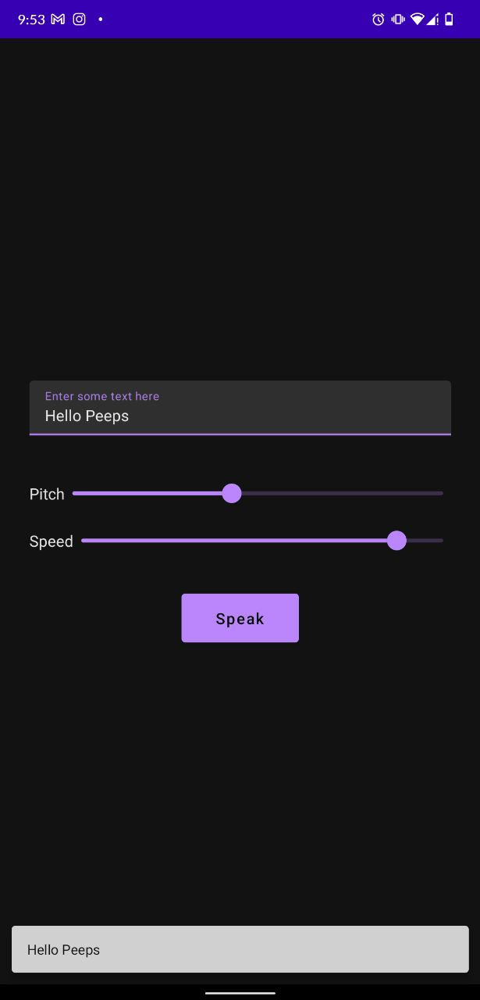

# SpeakUp 🎙

## Description 

An android app for Mute people to Speak Up their thoughts

- Provides a way for effective communication
- Can be also Used for fun 
- Has adjustment for Pitch and Speed
- First try of Kotlin and Jetpack Compose

## Table of Contents

If your README is long, add a table of contents to make it easy for users to find what they need.

- [Installation](#installation)
- [Technologies](#technologies)
- [Usage](#usage)

## Installation ⚙

- Download or Clone Repository
- build and run the app ▶

## Technologies

- Kotlin
- Android teJetpack Compose

## Usage

